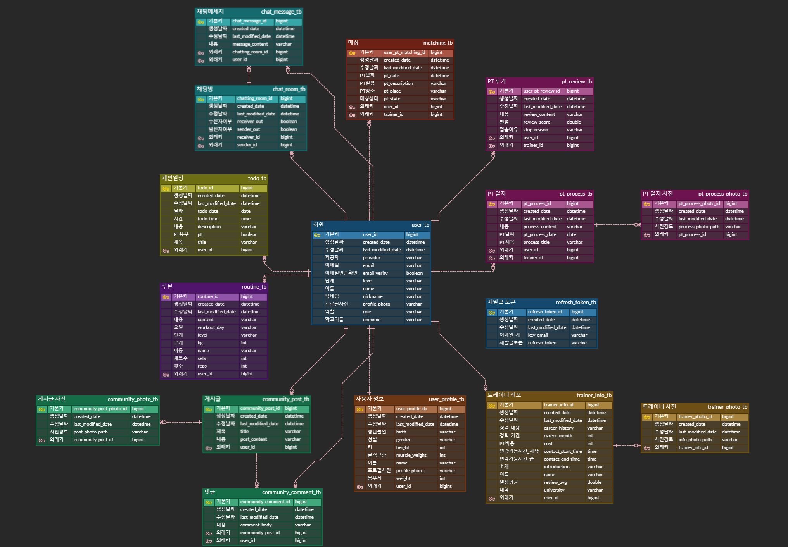
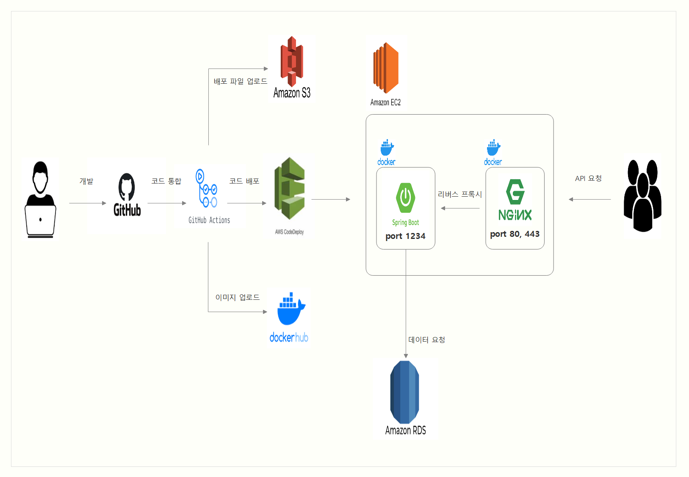
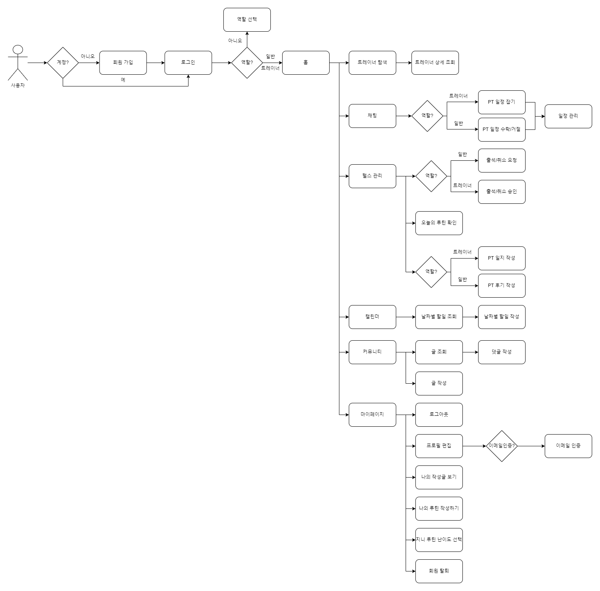
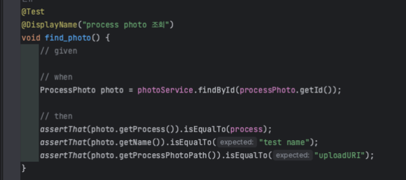
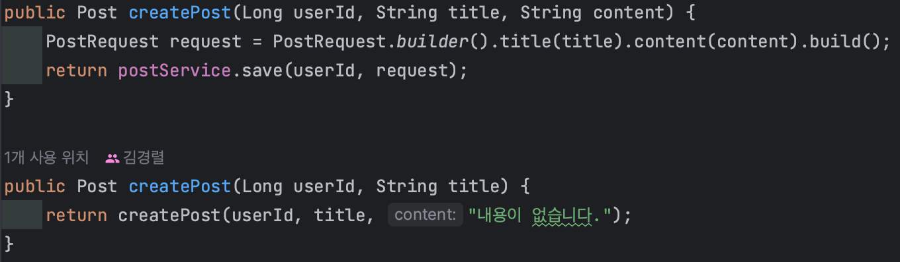
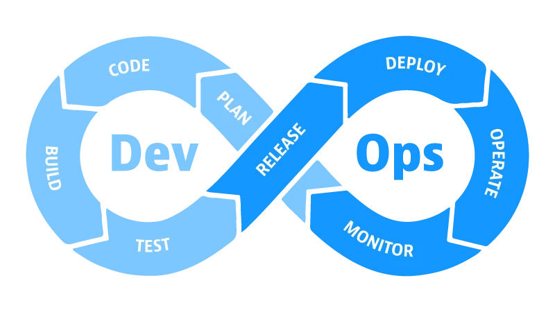
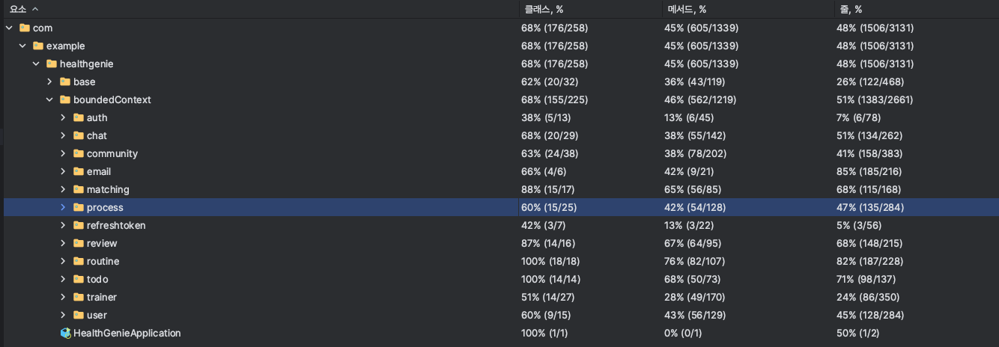
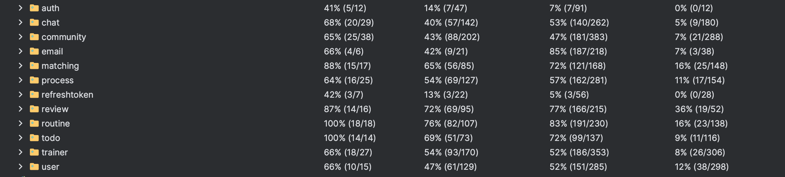

# 🏋️Health-Genie

### 📢 [배포 사이트 바로가기 - [ 바로가기 - 미정( 프론트 연동 중 ) ]]

## ✨ 프로젝트 소개

> 저희 Health-Genie는 학부생들의 체력 증진과 운동 수행 능력 향상을 위해 학부생간의 PT 매칭을 도와주는 서비스 입니다.
  
   

## 👨‍기술 스택

<h3 align="center">Language</h3>

<h3 align="center">Framework</h3>

 

<h3 align="center">Test</h3>

<h3 align="center">DB</h3>

  

<h3 align="center">Devops</h3>

   

 

<h3 align="center">Cooperation</h3>

   

 

## 🎨 ERD Diagram

[1차 ERD 설계](https://techj9972.tistory.com/205)

 

## 🔎 Project Architecture

 

## 📕 Health-Genie의 여정 소개

 

## 🧑‍💻 API 문서 보기

HEALTH-GENIE Postman API!!    [ 문서 보기 ](https://documenter.getpostman.com/view/31167063/2sA2xh4DR2)

## 🐧 TEST CODE
- "지속 성장 가능" 이라는 목적을 가지고 작성하였습니다.

### UNIT TEST
- 단위 테스트는 비즈니스 로직에서 코드의 단위가 아닌 동작의 단위를 기반으로 단위테스트를 진행하였습니다.
- 각각의 테스트 클래스마다 중복되는 작업들은 테스트 헬퍼 클래스를 작성하며, 메소드 명이 아닌 동작의 흐름을 이해할 수 있는 네이밍을 작성하였습니다.
- 회귀 방지, 리팩토링 내성, 빠른 피드백, 유지보수성 4가지에 초점을 맞춰 코드의 개발을 했습니다. 

  
  

 

## 🏛️ CI/CD 아키텍처 (배포 자동화)

### 배포 구조 (Github Action 배포 자동화)

### CI Flow
> Github 'production' Branch Push  → Github Actions → Project Build → Docker Image Build →  
Docker Hub Image Upload → AWS S3 Project File Upload

### CD Flow
> AWS CodeDeploy → Docker Container Stop -> Docker Image Pull -> Docker Run

 

## 🐥성능 테스트
수많은 학교의 회원 / 트레이너 유저들이 트레이너의 후기를 조회하거나 각각의 일지를 조회하는 경우 최대 몇 명의 사용자들이 서버를 사용할 수 있는지 상황을 확인하고 대비하고자 부하 테스트를 진행하여 로직을 개선해보고자 했습니다.  

### 후기 , 일지 조회

테스트 시나리오: 후기 / 일지 각각 2000건에 대한 요청 처리

부하 조건: 100명의 사람의 초당 트래픽 1000 

[ 일지 - 리팩토링 전 ]
 

[ 일지 - 리팩토링 후 ]

### 평균 응답시간 ( 0.45초 -> 0.17초 ) 약 60%, TPS ( 218 -> 572 ) 약 225% 개선이 이루어졌습니다

 

[ 후기 - 리팩토링 전 ]
 

[ 후기 - 리팩토링 후 ]

 

### 평균 응답시간 ( 1.7초 -> 0.3초 ) 약 75%, TPS ( 57 -> 270 ) 약 473% 개선이 이루어졌습니다

기존 review/process 각 table내에서 각각 사진과 글 table을 분리하여 매 API호출시 필요한 데이터만 호출하게 하며 검색 조건을 추가해 쿼리를 가볍게 만드는 방향으로 수정하였습니다.
결과적으로 평균 응답속도가 60%, 75% 만큼 향상 되었으며, TPS또한 225%, 473% 만큼 대폭 향상되었습니다.

 

## 📜 테스트 커버리지

[ 초기 테스트 커버리지 ]
 

 
테스트 커버리지 수치 자체를 목표로 둔다면 “지속 성장 가능” 이라는 키워드 보다는 “수치”에 잘못된 초점을 두게 되어 가치 있는 테스트가 아닌 거짓양성과 의미 없는 단순 테스트들 위주의 테스트가 될것이라고 생각하고, 100%가 아닌 60% 이상을 목표로 두었습니다
 

 
### 초기 57.83% → 64.75%로 개선하였습니다.

 

## 🥕프로젝트 백엔드 의사결정 및 이슈

### 최적화
[ 무한스크롤 도입 - 페이지 조회 성능 향상을 위한 고민](https://techj9972.tistory.com/276)  
[ Caching Exception ](https://techj9972.tistory.com/295)  

### 프로젝트 진행 이슈
[ 이메일 인증 전략 고민 (1) - Redis 사용](https://techj9972.tistory.com/238)  
[ 이메일 인증 전략 고민 (2) - Api 사용 ](https://techj9972.tistory.com/253)  

### 백엔드 이슈
[ 변경 감지를 통한 회원 정보 수정이 되지 않던 문제 ](https://kyeongryeol.notion.site/User-update-8eba600469ea49c8a4e01bcc7e4a4e6a?pvs=4)  
[ 커스텀 예외를 ExceptionHandler로 처리했음에도 500 Error가 터졌던 문제 ](https://kyeongryeol.notion.site/GlobalExceptionHandler-500-Server-Error-29821be0b9954473bc7dd3400f9352c9?pvs=4)  

 

## 🥃 Wireframe

[📝 Figma 바로가기 ](https://www.figma.com/file/Vo2fqi0lJnHjly8zuGbVuX/Health-Genie-기획-%2B-디자인?type=design&node-id=103-2&mode=design&t=l59LYYKYOFqaHSQJ-0)

