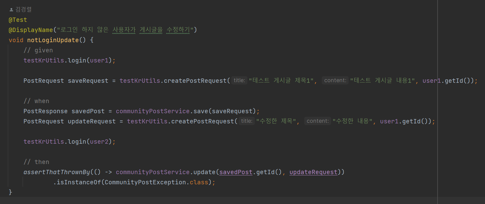
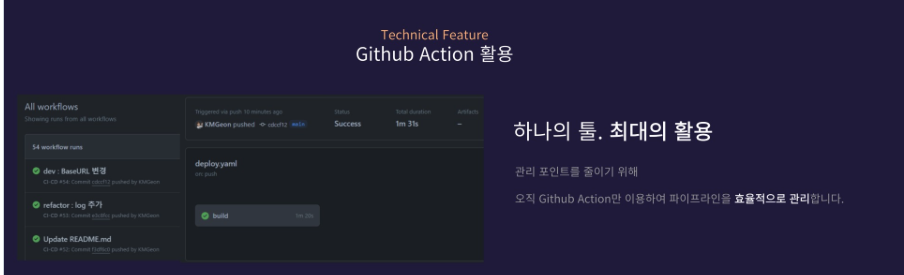

# 🏋️Health-Genie

### 📢 [배포 사이트 바로가기 - [ 바로가기 ]] [ 미정 ]

## ✨ 프로젝트 소개

### [ 프로젝트 간단 소개 ]

- 저희 Health-Genie는 대학교 헬스장에서 열심히 운동을 하는 학생들을 위한 플랫폼입니다. 각 학생들이 트레이너와 회원이 됨으로써 1:1 PT를 매칭해줍니다. 또한 트레이너와 학생은 PT를 통해 기존에 수기로 작성을 했던 출석체크, 회원의 운동 피드백 등을 작성할 수 있고, 트레이너와 회원 사이에서 공유할 수 있도록 Health-Genie에서 제공함으로써 편리성을 주며, 회원이 PT에 대한 후기를 작성함으로써 다른 회원이 PT를 매칭하려할때 정보를 참조할 수 있도록 제공할 수 있습니다. 그 외에도 본인만의 루틴을 작성하거나 Health-Genie에서 제공하는 운동 루틴을 통해서 운동 수행 능력을 본인의 목표에 맞게 증진시킬 수 있습니다.
  
   

### [ 프로젝트를 처음 기획을 생각한 이유 ]

- 학교 헬스장에서 운동을 하다가 우연치 않게 보건복지부에서 진행하는 "청년 체력 증진 사업"을 보았습니다. 헬스장에서 대학원생과 대학생이 트레이너와 회원이 되어서 PT를 진행하는 모습을 보았는데, 트레이너님들은 피드백, 출석체크를 종이에 수기로 작성을 하며, 피드백은 서로가 공유되지 않았고, 회원 입장에서 트레이너들에 대한 아무런 정보가 없었고 특정 트레이너를 선택해서 PT를 진행하는 구조가 아님을 알았습니다. 이러한 불편한 점들을 내가 개선해서 편리하게 이용할 수 있는 서비스를 만들면 어떨까? 라는 생각에서 기획하게 되었습니다.

   

### [ 프로젝트를 완성할 수 있었던 이유 ]

- 프로젝트를 진행하면서 가장 크게 느낀점은 '협업'과 서로의 '니즈'였습니다. 나의 니즈가 다른 팀원들의 니즈가 아님을 배웠습니다. 따라서 서로의 니즈를 충족하게끔 노력했고, 협업을 위해 주기적인 회의를 했고, 상대방이 특정 기능에 대해서 이해하기 쉽게끔 글 / 그림을 '노션' 을 통해서 설명하는 등 더 나은 커뮤니케이션을 하기 위해서 노력했습니다

   

## 👨‍기술 스택

<h3 align="center">어플리케이션</h3>

<h3 align="center">DB</h3>

  

<h3 align="center">인프라</h3>

   

<h3 align="center">문서 / 협업</h3>

   

 

## 🎨 ERD Diagram

1차 ERD 설계 > https://techj9972.tistory.com/205

 

## 📕 Health-Genie의 여정 소개

 

##  

## 🐧 TEST CODE
- 테스트 코드는 단순히 애플리케이션의 기능이 제대로 동작하는 것만 검증한다고 생각하지 않고, 제 3자가 봤을 때 해당 프로젝트에 어떤 기능들이 있으며 그에 따른 응답을 확인할 수 있는 수단이라고 생각합니다.

### UNIT TEST
- 단위 테스트는 비즈니스 로직의 가장 작은 단위인 각 메서드를 기반으로 테스트를 진행했습니다.
- 기존의 단위 테스트는 스프링을 사용하지 않고 빠른 속도와 독립적인 실행을 보장하는 것이 일반적이지만, 작업 일정과 개발 진행 상황에 따라 통합 테스트 작성을 하지 않고 단위 테스트에서 `@SpringBootTest` 애노테이션을 사용 함으로써 통합/단위 테스트를 진행했습니다.
- 각 메서드의 정상적인 기능 동작과 실행 속도 또한 통합 테스트에 비해 빠르며, 함께 필요한 의존성의 올바른 관계를 확인할 수 있습니다.
- 또한 각각의 테스트 클래스마다 중복되는 작업들은 테스트 유틸 클래스를 만들고 메서드 네이밍을 명확히 하여 사용 및 유지 보수하고 있습니다.

### INTEGRATION TEST
- 통합 테스트는 아직 진행하지 않았습니다.

 

## 🏛️ CI/CD 아키텍처 (배포 자동화)

### 1. 현재 배포의 구조 / 선택한 이유 (Github Action 배포 자동화)

 

## 🥕프로젝트 백엔드 의사결정 및 이슈

 

## 🥲 ERROR 모음집
https://techj9972.tistory.com/207  
https://techj9972.tistory.com/208  
https://techj9972.tistory.com/209  

 

## 🥃 Wireframe

[📝 Figma 바로가기 ]([https://www.figma.com/file/67asFaSpQCu4s2CKAJqxac/Untitled?type=design&node-id=0-1&mode=design&t=DdRtY5ictOvnNkSn-0](https://www.figma.com/file/Vo2fqi0lJnHjly8zuGbVuX/[NEW]-Quick-UXUI-Wireframe-templates!-(기획자와-디자이너를-위한-UXUI-화면기획서%2F화면설계서-템플릿)-(Community)?type=design&node-id=103%3A2&mode=design&t=Df94wCBw8sDIe8YI-1)https://www.figma.com/file/Vo2fqi0lJnHjly8zuGbVuX/[NEW]-Quick-UXUI-Wireframe-templates!-(기획자와-디자이너를-위한-UXUI-화면기획서%2F화면설계서-템플릿)-(Community)?type=design&node-id=103%3A2&mode=design&t=Df94wCBw8sDIe8YI-1)

